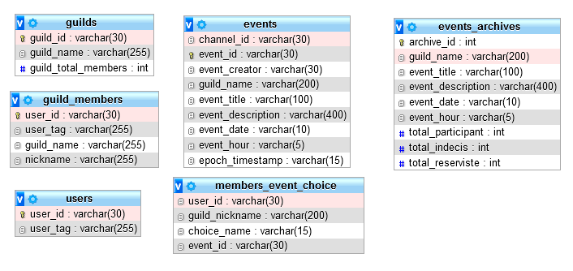

La base de données a été au dapart réalisé en SQL sur PhpMyAdmin mais un portage de la base de données sur MongoDB est en cours de réflection car une base de données en NoSql est plus facilement gérable en Node.js qu'en utilisant du SQL.

# Explication des tables

- La table **guilds** correspond aux serveurs Discord. Le terme "Guild" est le terme générique pour désigner les serveurs dans Discord. Je garde l'identifiant du serveur : l'identifiant d'un serveur discord est une suite de 18 chiffres. Je garde aussi le nom du serveur et le nombre total de membres du serveur à des fins de statistiques personnel.
- La table **guild_members** stock les utilisateurs présent dans un serveur. Le user_tag est désigne le compte d'un utilisateur et est sous la forme Thibault#0000. Nickname est le pseudo de la personne utilisé sur un serveur. Une personne n'a pas forcément de pseudo personalisé sur un serveur.
- La table **users** garde simplement l'identifiant et le tag d'un utilisateur.
- La table **event** est la plus importante, c'est ici que seront stocké les événements créé :
  - Je garde **l'identifiant du salon** où a été créé l'évenement car il sera utilisé pour **supprimer le message** de l'événement dans le code.
  - L'event_id est simplement **l'identifiant du message** envoyé par l'application comportant l'événement.
  - Je garde le nom du créateur de l'événement et le nom du serveur où a été créé l'événement pour des fins de statistiques personnel.
  - Un événement comporte un **titre**, une **description**, la date et l'heure de l'événement ainsi que le timestamp en **epoch** (L'epoch représente la date initiale à partir de laquelle est mesuré le temps par les systèmes d'exploitation). Cette donnée est créé par un convertisseur dans le code et est utilisé pour créé un compte à rebours dynamique dans le message de l'événement.
- La table **members_event_choice** stock le choix des utilisateurs à l'inscription d'un événement. Il y a 3 choix possible : "Participant", "Indécis" et "Réserviste" (sous réserve de). Un utilisateur pouvant s'incrire de différentes façon à d'autres événements, il faut que je lie l'identifiant de l'événement au choix de l'utilisateur.
- Enfin, la table **events_archives** sert uniquement pour des statistiques personnel. Un événement terminé sera stocké dans cette table.

